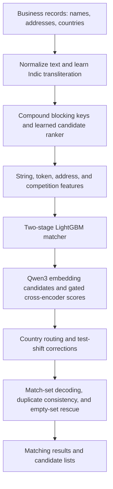

# Business Entity Resolution

A competition project for linking business records across three sources using names, addresses, and country. Each Source 1 record can match several records in Sources 2 and 3, or none. The work combines multilingual text normalization, learned candidate retrieval, two-stage LightGBM matching, neural reranking, and corrections for countries absent from the training labels.

## Problem

Business records describing the same entity can differ in spelling, script, word order, legal suffixes, and address details. Records for different businesses can also share similar names or the same address. The goal is to recover the correct set of matches for each Source 1 business while avoiding links to similar but distinct entities.

The evaluation metric is **macro F0.5**, averaged over Source 1 entities. It emphasizes precision and gives a score of 1 for correctly predicting an empty match set.

## Approach



## Work implemented

1. **Multilingual normalization:** Unicode folding, Indic-to-Latin transliteration learned from training pairs, alias handling, legal-form normalization, and address canonicalization.
2. **Candidate retrieval:** Compound name/address blocking keys and a learned LightGBM ranker reduce the target pool to a manageable set of candidates. Qwen3 embeddings provide an additional semantic retrieval channel.
3. **Pair features:** String similarities, exact and fuzzy token overlap, IDF-weighted evidence, house-number relations, record frequencies, and target competition describe each candidate pair.
4. **Two-stage matching:** A first LightGBM model scores individual pairs. A second adds context from candidate ranks, competing queries, and corroborating records. Training uses four folds grouped by Source 1 ID.
5. **Neural reranking:** Gated Qwen3 and XLM-R cross-encoders add evidence for uncertain pairs, with cross-fitted training scores stacked into the tree matcher.
6. **Distribution-shift handling:** Country routing, extended French normalization, and selected probability corrections address differences between training and test records.
7. **Match-set decisions:** Expected-F0.5 decoding, legal-form and type-word vetoes, duplicate consistency, and selective rescue of empty predictions refine the final match sets.

The pipeline reduces the search space before expensive scoring, combines lexical and neural evidence, and makes decisions at the level of each entity's complete match set.

## Repository layout

```text
code/business_entity_resolution/
  README.md                 Detailed implementation notes
  requirements.txt          Python dependencies
  src/                      Main pipeline, helpers, and diagnostics
    experiments/            Model variants and analysis scripts
    france_norm/            Earlier French normalization experiments
docs/                       Method, code map, reproduction, results, manifest
scripts/                    Source checks and local output-integrity audit
output/                     Matching results and candidate lists
```

## Experiments

The research scripts explore candidate recall, lexical versus dense retrieval, cross-encoder feature variants, French normalization, copy-versus-sibling patterns, uncertainty, and empty-query rescue. They also include paired OOF comparisons, country-level diagnostics, and duplicate checks.

## Results and outputs

The implementation notes report an OOF macro F0.5 of **0.99023** for the four-cross-encoder stage-2 system.

The recorded output contains **1,732,544 Source 1 entities**, **65,163,241 candidate pairs**, and **5,813,732 selected matches**. Each selected match appears in its corresponding candidate list.

- `matching_results.tsv`: selected target IDs for each Source 1 entity.
- `candidate_pairs.tsv`: candidate target IDs considered for each Source 1 entity.

Both formats support multiple targets and empty lists.

## Project documentation

- [Method and design decisions](docs/method.md)
- [Code map](docs/code-map.md)
- [Experiment guide](code/business_entity_resolution/src/experiments/README.md)
- [Results and evaluation details](docs/results.md)
